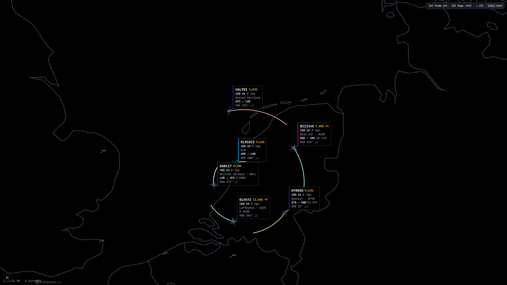
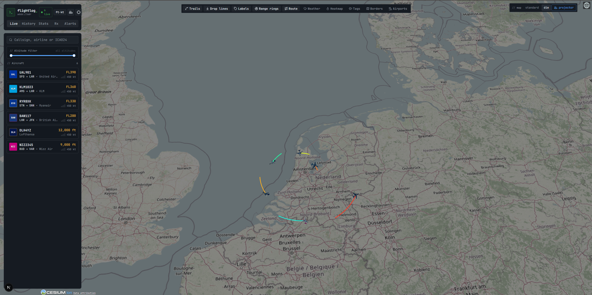
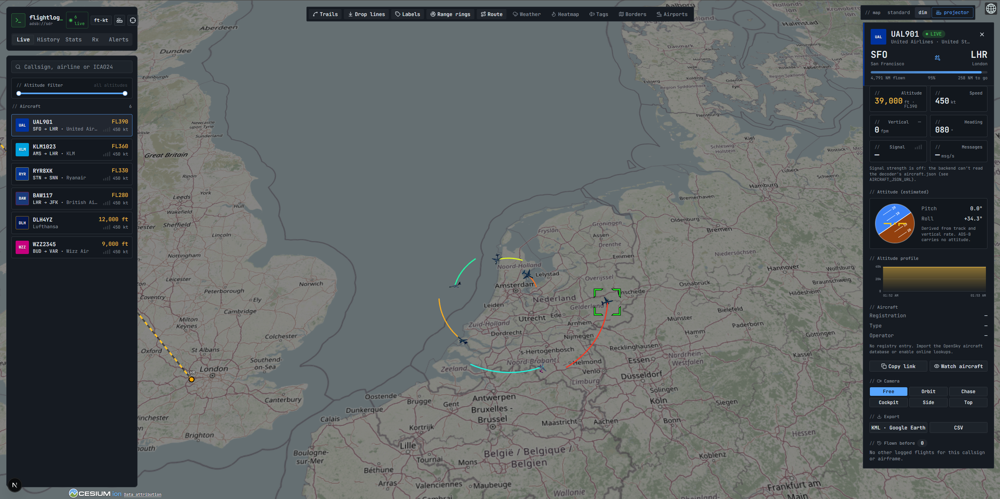
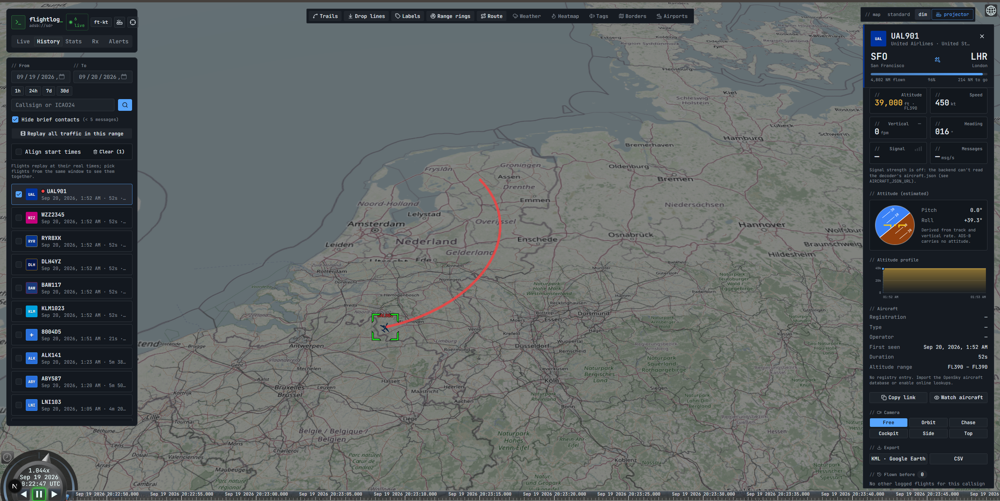
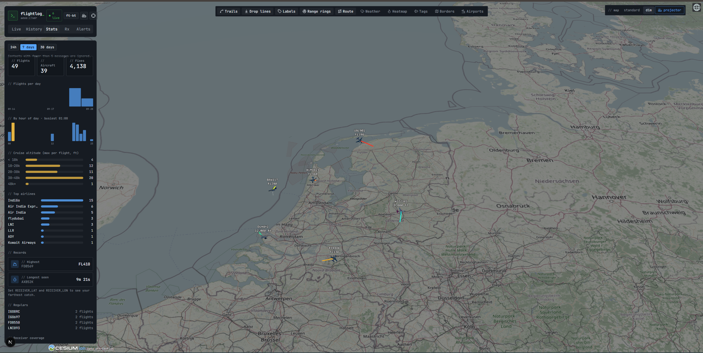

# FlightLog-SDR

**A 3D ADS-B flight logger for RTL-SDR.** It records every aircraft your receiver hears, shows live traffic on a 3D globe at true altitude, replays past flights on top of each other, tells you when something interesting shows up, and has a projector mode for putting the sky on a wall.

It sits on top of the SBS-1 output of [dump1090](https://github.com/flightaware/dump1090) or [readsb](https://github.com/wiedehopf/readsb), keeps everything in a local SQLite file, and needs no accounts or API keys.

```
RTL-SDR ─▶ dump1090 / readsb ─▶ SBS-1 (port 30003) ─▶ backend (FastAPI + SQLite) ─▶ web app (Next.js + CesiumJS)
                       └────── aircraft.json (signal strength) ───────┘
```



<table>
  <tr>
    <td width="50%"><br><sub><b>Live</b>: aircraft list, altitude filter, trails</sub></td>
    <td width="50%"><br><sub><b>Flight card</b>: route, readouts, estimated attitude, camera views</sub></td>
  </tr>
  <tr>
    <td width="50%"><br><sub><b>History</b>: pick flights, replay on a timeline</sub></td>
    <td width="50%"><br><sub><b>Stats</b>: flights per day and hour, cruise altitudes, top airlines</sub></td>
  </tr>
</table>

<sub>Screenshots use simulated traffic from `scripts/synth_sbs.py`.</sub>

## Highlights

- **Live 3D map**: aircraft at true altitude with airline-coloured models (about 25 liveries, six body shapes chosen from the aircraft type), altitude-coloured trails, drop lines and estimated pitch and roll.
- **Everything is logged**: flights, positions, signal strength. Ask "has this flight flown before?" from any flight, or overlay several flights from different days and replay them together.
- **Whole-sky replay**: play back all traffic in a time window at once.
- **Alerts**: emergency squawks (7500 / 7600 / 7700) and a watchlist of callsigns, airlines or airframes, with toasts, sound and browser notifications.
- **Signal strength** per aircraft, a **coverage plot** and **heatmap** of what your antenna reaches, and a **receiver gain** assistant that can adjust dump1090's gain.
- **Projector mode**: a black map with country and state outlines, airports, your receiver with range rings, glowing flight lines and sticky tags that follow each aircraft.
- **Stats**, KML / CSV export, airport activity (arrivals, departures, runway use), weather radar, units toggle, shareable links and a phone layout.

## Quick start

You need an RTL-SDR dongle with an antenna, a running decoder, **Python 3.11+** and **Node 20+**.

### 1. Start a decoder with its network output on

```bash
dump1090 --net          # Windows / dump1090-mutability / dump1090-fa
readsb --net            # readsb
```

That serves SBS-1 on port `30003` and (for signal strength) `aircraft.json` on port `8080`.

### 2. Run it

One command does the first-time setup (Python environment, packages, `backend/.env`, web build) and starts the API and the web app together. Ctrl+C stops both.

```bash
.\start.ps1            # Windows (PowerShell)
./start.sh             # Linux / macOS
```

Open http://localhost:3000. Aircraft appear within seconds of the first one being received. Set `RECEIVER_LAT` / `RECEIVER_LON` in `backend/.env` and restart.

Options: `-Lan` / `--lan` to reach it from other devices on your network, `-Dev` / `--dev` for the hot-reloading dev server, `-ApiPort` / `-WebPort` (Windows) or `API_PORT` / `WEB_PORT` (Linux/macOS) to change ports, and `-Rebuild` / `--rebuild` after changing the API port or pulling new code.

<details>
<summary>Manual setup instead</summary>

**Backend**

```bash
cd backend
python -m venv .venv
.venv/bin/pip install -r requirements.txt            # Windows: .venv\Scripts\pip install -r requirements.txt
cp .env.example .env                                  # then edit .env (at least RECEIVER_LAT / RECEIVER_LON)
.venv/bin/python -m uvicorn app.main:app --port 8000  # Windows: .venv\Scripts\python -m uvicorn ...
```

**Web app**

```bash
cd frontend
npm install
npm run dev            # http://localhost:3000
```

Open http://localhost:3000. Aircraft appear within seconds of the first one being received.

</details>

### Or with Docker (optional)

The backend and web app can run in containers; the decoder and the dongle stay on your machine.

```bash
cp backend/.env.example backend/.env    # optional: set RECEIVER_LAT / RECEIVER_LON etc.
docker compose up --build               # http://localhost:3000
```

- The backend reaches the decoder at `host.docker.internal` (ports 30003 and 8080), so the decoder must listen on all interfaces. Override with `SBS_HOST`, `SBS_PORT` and `AIRCRAFT_JSON_URL` if it lives elsewhere.
- The flight log is kept in the `flightlog-data` volume.
- Ports are `3000` (web) and `8000` (API). If 8000 is taken, set `BACKEND_PORT=8010` and `NEXT_PUBLIC_API_URL=http://localhost:8010` (in your shell or a `.env` next to `docker-compose.yml`) before building.
- Gain control (Rx tab) is off in Docker because it edits the host's `dump1090.cfg`; run the backend natively for that.
- To open it from another device, build with `NEXT_PUBLIC_API_URL=http://<this-pc-ip>:8000 docker compose up --build`.

**No SDR yet?** Try it with fake traffic:

```bash
python scripts/synth_sbs.py 30003 52.3 4.76     # six aircraft flying circles (port, lat, lon)
python scripts/seed_demo.py                      # optional: departures on previous days, for History
```

Use a free port: if a real decoder is running it already holds `30003` and the script fails with a permission error. Pick another port (for example `30098`) and start the backend with `SBS_PORT=30098` (and `DB_URL` pointing at a separate file so demo data stays out of your real log).

## Configuration

Settings are environment variables. Put them in `backend/.env` (copy [`backend/.env.example`](backend/.env.example), which documents every one); real environment variables win over the file.

| Variable | Default | What it does |
|---|---|---|
| `SBS_HOST` / `SBS_PORT` | `127.0.0.1` / `30003` | the decoder's SBS-1 output |
| `RECEIVER_LAT` / `RECEIVER_LON` | `0` / `0` | your antenna: map home, range rings, coverage, farthest catch |
| `DB_URL` | `sqlite+aiosqlite:///./flightlog.db` | database |
| `AIRCRAFT_JSON_URL` | `http://127.0.0.1:8080/data/aircraft.json` | decoder web feed, for signal strength (empty = off) |
| `ENRICH_ONLINE` | `0` | `1` = look up aircraft, routes and photos online (see [Privacy](#privacy-and-network)) |
| `AIRPORT_ICAO` / `_NAME` / `_LAT` / `_LON` / `_ELEV_FT` / `_RUNWAYS` | off | airport activity board; set the position to enable |
| `RETENTION_DAYS` / `THIN_KEEP_SECONDS` | `0` / `10` | thin old positions daily (0 = keep everything) |
| `FLIGHT_GAP_SECONDS` | `1200` | silence that ends a flight |
| `RECEIVER_CONTROL` / `DUMP1090_CFG` | `1` / auto | let the Rx tab edit dump1090's gain (local machine only) |

The web app needs no configuration. It talks to the API on the same host it was opened from, port 8000. Override with `?api=http://host:8000` in the address, or `NEXT_PUBLIC_API_URL` in `frontend/.env.local` (see [`frontend/.env.example`](frontend/.env.example)).

## Using it

| Tab | What it is for |
|---|---|
| **Live** | aircraft list with route, altitude and signal bars; "overhead now" (nearest aircraft and who passes closest soon); altitude filter |
| **History** | pick a time range, search, overlay flights in colours, scrub the timeline; **Replay all traffic** in the range |
| **Stats** | flights per day and hour, cruise altitudes, top airlines, records, receiver coverage, airport activity, database size |
| **Rx** | tuner gain, the gain assistant, live signal mix, per-gain comparison |
| **Alerts** | alert history, watchlist, notification and sound settings |

Click an aircraft for its card: readouts, artificial horizon, altitude and signal profiles, route with progress, photo, camera views (orbit, chase, cockpit, side, top), *Flown before*, *Watch aircraft*, *Copy link* and KML / CSV export.

**Keys:** `H` home · `C` cycle camera view · `Esc` close · `P` projector mode · in projector: `D` tag detail · `A` frame all traffic · `F` fullscreen.

### Projector mode

Press `P` or use the **projector** button in the `map` switch at the top right. The map goes black and only the essentials remain: country and state outlines, airports, your receiver with labelled range rings, and every aircraft with a bright glowing flight line and a **sticky tag** (callsign, altitude, speed, climb, airline, type, route, registration, heading, signal). Tags follow their aircraft, avoid each other and flip at screen edges; an emergency squawk pulses red. A `?projector=1` link opens straight into it, handy for a wall display.

### Receiver gain

The **Rx** tab shows dump1090's tuner gain and can change it. dump1090 only reads gain at start-up, so *Save to config* edits the `gain =` line of `dump1090.cfg` (with a backup) and *Save & restart* also restarts dump1090, checks the feed returns and rolls back if it doesn't. It works for the Windows dump1090 and only from the machine running the backend. The assistant reads the live signal mix and a table compares message rate, signal and reach for each gain you have tried.

## How it works

- **Backend** ([`backend/`](backend)): FastAPI. `ingest/sbs.py` parses the SBS-1 stream, `ingest/tracker.py` keeps live state and splits flights, `recorder.py` writes them to SQLite. Other modules cover enrichment, attitude estimation, alerts, coverage, replay, airport activity, signal, gain and housekeeping. Endpoints live under `/api`, live data on the `/api/ws/live` WebSocket.
- **Web app** ([`frontend/`](frontend)): Next.js, Tailwind and shadcn/ui on CesiumJS. Aircraft models are generated on request by a route handler (`/models/<shape>/<airline>.gltf`). Projector mode's floating tags are HTML positioned every frame from the map.
- **Data**: SQLite tables for flights, positions, alerts, watchlist, aircraft registry, route cache and gain samples. Existing databases are upgraded in place when columns are added.

Attitude is **estimated**: ADS-B carries no pitch or roll, so heading is the ground track, pitch comes from vertical rate and ground speed, and roll from the turn rate.

## Privacy and network

- **Nothing leaves your machine by default.** With `ENRICH_ONLINE=1` the backend sends the callsigns and ICAO24 addresses of aircraft you receive to [adsbdb.com](https://www.adsbdb.com) (aircraft, routes) and [planespotters.net](https://www.planespotters.net) (photos), and caches the answers. The map fetches OpenStreetMap tiles, and the weather layer fetches RainViewer radar tiles.
- **No login.** If you serve it to your network (`uvicorn --host 0.0.0.0`, `npm run dev -- -H 0.0.0.0`) anyone on that network can view it. The API only accepts browsers from localhost and private network addresses, and gain control only from the machine itself. Don't expose it to the internet.
- Your flight log (`flightlog.db`) and `.env` are git-ignored.

## Development

```bash
cd backend && python -m pytest -q            # 56 tests, no hardware or network needed
cd frontend && npx tsc --noEmit && npx eslint src && npm run build
```

Useful scripts: `scripts/synth_sbs.py` (fake feed), `scripts/replay_sbs.py capture.sbs` (replay a capture), `scripts/seed_demo.py` (demo history), `frontend/scripts/make-geo.mjs` (regenerate the projector map data), and `python -m app.maintenance info|thin|backup` (database housekeeping; run from `backend/`).

Tests never read your `.env`, never touch the network and never look for a real decoder.

## Troubleshooting

- **"offline" or no aircraft**: is the decoder running with its network output on? `curl --no-buffer http://127.0.0.1:30003` should stream `MSG,...` lines. Set `SBS_HOST` / `SBS_PORT` if it is elsewhere. A quiet sky is normal at times.
- **Signal bars are grey / "Signal strength is off"**: the backend can't read `AIRCRAFT_JSON_URL`. Open it in a browser to check it works, and restart the backend after changing settings. With dump1090 for Windows keep `web-send-rssi = true`.
- **Map is empty or far away**: set `RECEIVER_LAT` / `RECEIVER_LON` and restart the backend.
- **Rx tab says it can't find dump1090.cfg**: start dump1090 first, or set `DUMP1090_CFG`.
- **Aircraft show as generic narrow-body**: the aircraft type comes from the registry. Set `ENRICH_ONLINE=1` or import the OpenSky aircraft database with `python -m app.enrich_import aircraftDatabase.csv`.

## Limits

- Altitude is barometric and drawn as height above the ellipsoid, so it can differ from true height by up to about 100 m. There is no terrain.
- Signal strength is relative to your gain, antenna and cable; compare aircraft on your own receiver, not with other people's numbers. It is recorded from the moment the feature is on.
- Airport activity is inferred from what your receiver heard low near the field. Go-arounds are a best guess.
- Country-of-registration comes from the main ICAO address blocks only.
- Weather radar tiles stop at zoom 7 and look blocky when zoomed in.

## Credits

Built on [CesiumJS](https://cesium.com/platform/cesiumjs/) (Apache-2.0), [Next.js](https://nextjs.org), [shadcn/ui](https://ui.shadcn.com), [FastAPI](https://fastapi.tiangolo.com), [SQLAlchemy](https://www.sqlalchemy.org) and [JetBrains Mono](https://www.jetbrains.com/lp/mono/) (OFL).
Map data: [OpenStreetMap](https://www.openstreetmap.org/copyright) contributors (tiles; please respect the [tile usage policy](https://operations.osmfoundation.org/policies/tiles/)), [Natural Earth](https://www.naturalearthdata.com) (country and state borders, public domain, via [`world-atlas`](https://github.com/topojson/world-atlas)), airport codes from [OurAirports](https://ourairports.com) (public domain), weather radar by [RainViewer](https://www.rainviewer.com).
Optional online lookups: [adsbdb](https://www.adsbdb.com) and [planespotters.net](https://www.planespotters.net) (photos are credited to their photographers in the app).

## License

[Apache License 2.0](LICENSE). You may use, modify and redistribute it, but you must keep the copyright and [`NOTICE`](NOTICE) file and mark files you changed. Third-party components keep their own licences.
